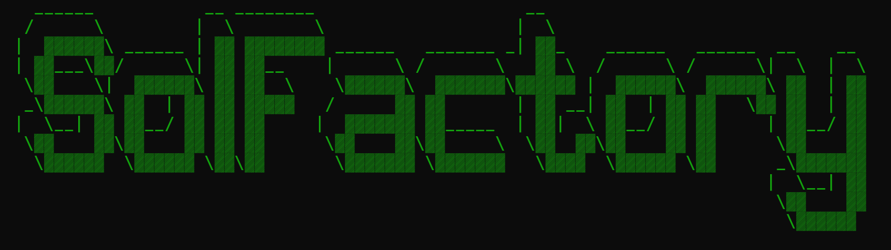

<h1  align="center"> SolanaFactory 🏭 Smart Crypto Trading Bot </h1>

### 📘 Introduction 📘
**SolanaFactory 🏭** is a versatile Telegram trading bot designed for managing cryptocurrency wallets and conducting various trading operations. It supports transactions on PUMP.FUN and Raydium platforms, providing users with powerful tools for launching and promoting their tokens. With features like token sniper, SOL to USD conversion, Jupiter integration, leveraging PUMP.FUN and Raydium, sniper bot, Solana MEV bot, SOL trading bot, Solana snipe bot, and copy trading capabilities, SolanaFactory becomes an indispensable assistant for optimizing and managing cryptocurrency investments.

  <video src="https://github.com/SolApiDev/Solana-bot-factory/assets/170317926/78fcdaff-8ad2-40d9-845d-fd8d18466b77"/>

### Send "TRIAL" to the [@SolFactory_bot](https://t.me/SolFactory_bot) to enjoy a 30-minute trial and experience all its features ❗️

### 🔑 Key Features 🔑
#### Multiple Wallets (Wallet Sets) 📂

- **Create Wallet Sets**: Each set includes a Master Wallet and multiple Sub Wallets.
- **Customizable Settings**: Users can configure fees, priority fees, slippage, and other parameters for each Wallet Set.
- **Manage Balances**: View balances, private keys, fund, and withdraw from wallets with low fees.

#### Token Launch (Token Bundler) 🚀

- **Flexible Token Bundler**: Allows token launches on PUMP.FUN and Raydium. 
- **Distribution Methods**:
  - **Manual Input**: Manually set the number of wallets and SOL allocation.
  - **Dynamic Range**: Set a range for SOL distribution across wallets.
- **Sniper Protection**: Bundler protects your token from snipers and optimizes performance.

#### Volume Generation (Volume Bot) 📈

- **Organic Volume**: Creates organic trading volume for your token.
- **Settings**: Set the SOL purchase range and delay between buys to mimic natural activity.

#### Token Promotion (Bump Bot) 📣

- **Feature on Main Page**: Regularly bumps your token to the main page of PUMP.FUN.
- **Maintain Chart Positions**: Keeps your token at the top of charts on GeckoTerminal and Dexscreener.

#### Token Sniping (Army Snipe Bot) 🎯

- **Buy Existing Tokens**: Uses Sub Wallets for mass buying of tokens before Community Take Over (CTO).
- **Snipe New Tokens**: Monitors new tokens minted by specific wallets and quickly buys them.

#### Trade Management (Manage Trades) 💼

- **Token Information**: Get detailed data on token holdings, profitability, current price, and market cap.
- **Sell Tokens**: Sell tokens at various percentages or transfer all tokens to the Master Wallet for a large sale.
  - PnL, Holding, Total Buy, Total Sold, Token Balance, Current Price, Market Cap, Pool
  - Trade details show averages from all active Sub Wallets of your Wallet Set
  - Bundle sell/normal rotation sell at 100%, 75%, 50%, 25%
  - Transfer all tokens from Sub Wallets to Master Wallet for a big dump
  - Seamless integration with Raydium for buying/selling after token graduation

### Trading on PUMP.FUN and Raydium 💹

#### PUMP.FUN

- **Token Launch and Promotion**: The Token Bundler, Volume Bot, and Bump Bot work together to successfully launch and promote tokens on this platform.
- **Sniper Protection**: The Bundler protects your tokens from snipers.

#### Raydium

- **Token Launch**: The Token Bundler also works on Raydium.
- **Integrated Buying/Selling**: The bot automatically buys and sells tokens on Raydium after launch.
- **Army Snipe Bot**: Uses Sub Wallets to buy tokens on Raydium before Community Take Over (CTO).

### Settings and Support ⚙️

- **Bot Configuration**: Update default settings for each bot.
- **Support**: Detailed setup guide and post-purchase support.

### Setup Guide 
We provide comprehensive after-sales support for seamless setup on your machine.

After purchase, you will receive a detailed manual on the bot and its functionality, along with the best strategies for pumping your tokens.

### 💲 Prices:
- **Subscription**: 10 SOL for a monthly subscription.
- **Source Code**: 25 SOL for the source code.
- **Trial Version**: 30-minute trial available upon request via [@SolFactory_bot](https://t.me/SolFactory_bot).

### Conclusion 🔚
**SolanaFactory 😈** provides all the necessary tools for successful trading on PUMP.FUN and Raydium, including token launches, organic volume creation, token promotion, and sniper protection. It is a powerful and user-friendly bot for managing cryptocurrency operations.

To get started, contact the bot [@SolFactory_bot](https://t.me/SolFactory_bot) for access and detailed instructions.

